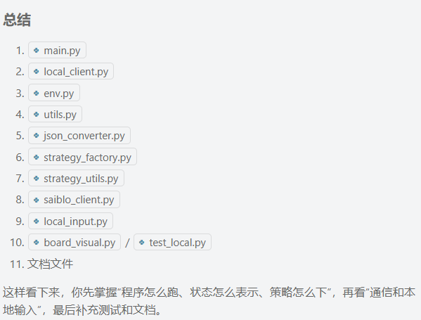
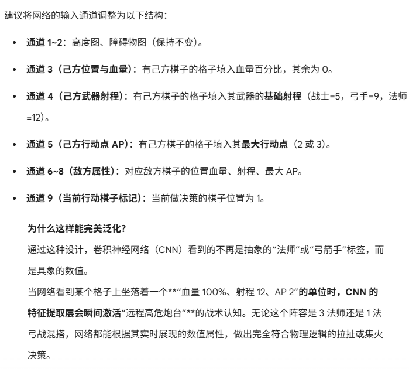

这是 ai 给的阅读顺序

main.py 是与服务器沟通的，应该是与其它人对战时需要使用。
而 local_client.py 是用作自我调试。

env.py 中：
```
    def set_max_action_points(self):
        if self.piece.strength <= 13:
            self.set_max_action_points_to(1)
        elif self.piece.strength <= 21:
            self.set_max_action_points_to(2)
        else:
            self.set_max_action_points_to(3)
```
说明 13 21 的力量属性是我们行动点的分配区间。

```
    def set_max_spell_slots(self):
        if self.piece.intelligence <= 3:
            self.set_max_spell_slots_to(1)
        elif self.piece.intelligence <= 7:
            self.set_max_spell_slots_to(2)
        elif self.piece.intelligence <= 12:
            self.set_max_spell_slots_to(3)
        elif self.piece.intelligence <= 16:
            self.set_max_spell_slots_to(5)
        elif self.piece.intelligence <= 21:
            self.set_max_spell_slots_to(8)
        else:
            self.set_max_spell_slots_to(9)
```

这是我们法术点的行动区间。


```
    def strength_adjustment(self):
        if self.piece.strength <= 7:
            return 1
        elif self.piece.strength <= 13:
            return 2
        elif self.piece.strength <= 16:
            return 3
        else:
            return 4

    def dexterity_adjustment(self):
        if self.piece.dexterity <= 7:
            return 1
        elif self.piece.dexterity <= 13:
            return 2
        elif self.piece.dexterity <= 16:
            return 3
        else:
            return 4

    def intelligence_adjustment(self):
        if self.piece.intelligence <= 7:
            return 1
        elif self.piece.intelligence <= 13:
            return 2
        elif self.piece.intelligence <= 16:
            return 3
        else:
            return 4

```
力量，动作和智力同样也是分成4个档。

生命值      = 30 + strength × 2
行动点      = f(strength)     # 力量 ≤13:1点, ≤21:2点, >21:3点
法术位      = f(intelligence) # 智力越高越多（1-9个）
移动力      = dexterity + 0.5 × strength + 10 +（3，0，-3 护甲导致的）

行动顺序roll完之后就不可改变了。

我现在要完成两个函数。

init_strategy -> Callable[['InitGameMessage'], List[PieceArg]]:
action_strategy -> Callable[[Environment], ActionSet]:

```python
from utils import PieceArg

piece_arg = PieceArg()

# 属性
piece_arg.strength      # int - 力量属性 (0-30，总和不超过30)
piece_arg.dexterity     # int - 敏捷属性 (0-30，总和不超过30)
piece_arg.intelligence  # int - 智力属性 (0-30，总和不超过30)
piece_arg.equip         # Point - 装备 (x=武器类型1-4, y=防具类型1-3)
piece_arg.pos           # Point - 初始位置
```


class ActionSet:
    def __init__(self):
        self.move = False;
        self.move_target = Point()
        self.attack = False
        self.attack_context = None  # AttackContext
        self.spell = False
        self.spell_context = None  # SpellContext

class InitGameMessage:
    """游戏初始化消息"""
    def __init__(self):
        self.piece_cnt: int = 0  # 棋子数量
        self.id: int = 0  # 玩家ID
        self.board: Optional[Board] = None  # 棋盘

Enviroment 在 env.py 中。


你施法的位置是和本人相关的，这个是由 Spell 提前设置好的，由 Spell.range 来设置。target area 是由半径来决定的。

不对！

对于任意施法者而言，必须要有相应的人在 range 范围之内才能说可以释放，而我们的 target_area 确实是根据 redius 来确定的，这没用，这是我们甚至可以自己设置的。

区域半径仅仅和范围法术有关，也就是说，radius 是用来设置范围的，可是只有范围法术用到了范围。

max_movement = dexterity + 0.5 × strength + 10 + 护甲调整



网络：

卷积层 + 残差块 + 全连接层


我现在模型的输入通道有14个：
1 2 是地图和高度图·
3 4 是双方的普通攻击图，表示某个棋子在图中对能攻击到的位置造成的总伤害，同队不同棋子之间叠加·
5 6 是双方棋子的血量·
7 8 是双方棋子的抗性·
9 是双方棋子的先后手顺位，数值越大越先动。·
10 11 是双方棋子还能释放的法术的剩余次数·
12 13 表示双方能释放的攻击法术的范围和伤害的图像·
14 焦点棋子（one-hot）
15 阶段指示器（当前若是移动回合填 0.3，攻击回合填 0.6，施法回合填 1.0，整张图全部铺满这个数字）
16 移动力地图
17 行动点地图

归一化要用全局最大值。

这个就是我们的输入了。

我们的输出有：

网络的输出有 5 个头。

第一个头：

开关（二分类）输出2个值，表示概率，softmax 后用概率摇号，代表跳过当前阶段或者执行当前阶段

第二个头：

20 * 20的数组，表示移动到每个点上的概率以及不移动。移动到自身就是不移动。最后处理的时候要结合棋子的移动力。

第三个头：

同样是一个 20*20的数组，表示攻击到每个点的概率。但是我们要对地方的位置和能攻击到的范围进行掩码。

第四个头：

是一个 4 * 20 * 20 的数组，代表四种法术在每一个格子上释放的概率，经过范围掩码，和队伍掩码（法术也是对人释放的）后，做一个全局的softmax。

第五个头：

一个数，代表 value。

损失函数：

开关头用二分类的交叉熵

价值头用 MSE

其余的三个头，如果开关为 0，则不计算 loss。

如果训练数据和模型都告诉你开关为 1，这个是否才会对应分阶段的去计算各个动作头的损失。

github copilot 命令：

我现在需要你帮助我写 model.py 和 model_train.py，帮助我完成模型的构建和训练。

输入：
我现在模型的输入通道有17个：
1 2 是地图和高度图·
3 4 是双方的普通攻击图，表示某个棋子在图中对能攻击到的位置造成的总伤害，同队不同棋子之间叠加·
5 6 是双方棋子的血量·
7 8 是双方棋子的抗性·
9 是双方棋子的先后手顺位，数值越大越先动。·
10 11 是双方棋子还能释放的法术的剩余次数·
12 13 表示双方能释放的攻击法术的范围和伤害的图像·
14 焦点棋子（one-hot）
15 阶段指示器（当前若是移动回合填 0.3，攻击回合填 0.6，施法回合填 1.0，整张图全部铺满这个数字）
16 移动力地图
17 行动点地图

地图：是一个网格。能走的地方为 1，不能走的地方为 0，大小20*20。默认的地图输入不能走的地方是 -1，你要实现对应的方法保证地图中只有 0 和 1.
高度图：用 10 去归一化。最低的位置可能不是 0，你要有对应的方法保证地图中最低的位置是 0。大小20 * 20.
棋子的血量图：用 110 去归一化 大小 20 * 20
棋子的抗性图：用 23 去归一化 大小 20 * 20
先后手顺位：用 6 去归一化，值越大代表越先出动 大小 20 * 20
法术剩余次数，用 5 去归一化 大小 20 * 20
攻击范围和伤害图：用 150 去归一化 大小 20 * 20
焦点棋子（one-hot）大小 20 * 20
阶段指示器（当前若是移动回合填 0.3，攻击回合填 0.6，施法回合填 1.0，整张图全部铺满这个数字）大小 20 * 20
移动力地图，代表每个棋子最远能走多远的距离，用 40 去归一化
行动点地图，代表每个棋子还剩下多少行动点，用 3 去归一化。

网络的输出有 5 个头。

第一个头：

开关（二分类）输出2个值，表示概率，softmax 后用概率摇号，代表跳过当前阶段或者执行当前阶段

第二个头：

20 * 20的数组，表示移动到每个点上的概率以及不移动。移动到自身就是不移动。最后处理的时候要结合棋子的移动力。

第三个头：

同样是一个 20*20的数组，表示攻击到每个点的概率。但是我们要对地方的位置和能攻击到的范围进行掩码。

第四个头：

是一个 4 * 20 * 20 的数组，代表四种法术在每一个格子上释放的概率，经过范围掩码，和队伍掩码（法术也是对人释放的）后，做一个全局的softmax。

第五个头：

一个数，代表 value。范围是 -1 到 1 之间，-1代表输的概率越大，1代表赢得概率越大。

损失函数：

开关头用二分类的交叉熵

价值头用 MSE

其余的三个头，如果开关为 0，则不计算 loss。

如果训练数据和模型都告诉你开关为 1，这个是否才会对应分阶段的去计算各个动作头的损失。


现在这个模型应该是没问题了。

但是模型的训练还是有问题。

我们现在已经完成了：

- 损失函数的计算：给我模型输出和训练数据，我能计算损失。
- 给我一张图，我能进行归一化

我们需要完成的是：

github copilot 命令：

1. 你在 model_train.py 里面写一个数据处理类，这个类可以完成以下任务：接受一个 Environment 类型的实例，返回相应的模型输入，你那个归一化的函数可以不用改，直接放在类里。
2. 你需要给我一个 puct-mcts 框架，注意这个 puct-mcts 是层级化拓宽的，也就是说，模型先输出行动到哪个点，再输出攻击哪个棋子，再输出对哪个棋子施加法术，这在 puct-mcts 中视作 3 个不同的树节点。总的而言，这个 puct-mcts 类需要接受 Enviroment 类型的输入，借助我们当前的模型，返回一个策略，这个策略是一个 ActionSet 的实例。
3. 你需要改变 model_train.py 中的关于训练模型的代码，因为我们并没有一个现成的数据集去使用。数据由模型自我对弈或者与现成的小策略对弈得到。所以我需要你给我提供一份代码，使得我可以选择与 stragety_fatory 中的策略去对弈或者自我对弈去产生数据，并训练模型。一个iteration训练完之后，你的数据和模型都要存放在本地工作站，以保证我可以随时开始训练或结束训练，这也要求你要有恰当地实现来保证我可以随时开始训练或结束训练。
4. 我需要你在 strategy_factory.py 的基础上添加 4 个初始化策略，分别是（加点分别是力量、法术、敏捷）：
    1. 3个弓箭手，加点 30 0 0，穿重甲
    2. 3个弓箭手，加点 22 4 4，穿重甲
    3. 2个弓箭手1个法师，弓箭手加点 22 4 4，穿重甲，法师加点 4 22 4
    4. 1个弓箭手2个法师，弓箭手加点 30 0 0，法师加点 4 22 4
    5. 3个法师，加点均为 4 22 4
5. 我需要你更改训练代码。训练过程中，玩家一用的是四种初始化中的一种，用puct-mcts策略，玩家二可以用四种初始化的一种，同时也用 puct-mcts，也可以用 strategy_factory.py 中的任何一种自定义策略和行动策略。

在运行之前，我需要对代码进行最后的检查。

model_train.py 审查已完成
dataset_utils.py 审查已完成
self_play.py 审查已完成
mcts.py
strategy_factory.py 审查已完成
state_processor.py 已经审查完成

现在是2026.5.18 16:51，我们再次测试 local 对战 mode 是否出错。

main.py
local_client.py
env.py
utils.py
json_converter.py
strategy_utils.py
saiblo_client.py
local_input.py
board_visual.py
test_local.py

应该没有问题。只需要关注我们改变的上面的那几个。大概率是有问题的。

2026.5.19 我们先对 state_processor.py 进行审查

x 对应的是 width
y 对应的是 height

单体法术必须要对着人放，检查 target

范围法术对着一个中心点放，检查的是 target_area

这个 model_train.py 应该没有什么问题。

现在重点关注三个函数：

1. collect_self_play_examples
2. create_dataloader
3. build_model

目前正在审查 collect_self_play_examples

这里我们处理数据的时候，就假设我们的攻击目标等等都是合法的。

我们最好想改的就是希望能够实现一个样本池,里面有 80000 左右的样本条数,从里面拿数据进行训练.

其次就是 30 要改成 29, 力量.

prompt

我希望你帮助我实现以下目标：

1. 实现一个样本池，里面有 80000 左右的样本条数，从里面拿数据进行训练.但是我们每次保存的数据仍然是每次 iteration 新生成的数据。
2. 我们每次 iteration 都生成一个新的 model，请把这个模型放在以成勋运行开始时间为名字的文件夹下，并且将本次模型训练最优的模型保存在 best_model 文件夹下，文件名是 best_model.pt，模型最优的选择是与之前的模型进行对战，两边选择同样的 arch29 的初始化策略，各为player1 对战5次，一共对战10次统计胜率，胜率严格高于 50 % 则保留，这个对战次数和保留胜率要能够自己调节。
3. 请删除不必要的调试信息，并增加必要的调试信息：训练iteration要用进度条可视化，要汇报预测剩余时间和已经用过的时间，每次对战要汇报胜率，输赢平各自的局数。


1. epoch 可以再调高一点，连带着我们的 batch_size 可以再调高。epoch我觉得可以调到 200
2. 我的预期是在 15 epoch 内，不能全输给 agressive 策略
3. 应该要输出当前数据库的长度
4. evaluation 创建进度条。
5. 提供评估评估模型的开关，如果为 false，就不评估模型，如果是 true，就评估，每10次iteration评估一次，也就是说，例如我们模型训练了10次，然后再训练10次，是用训练20次的模型和10次的模型 pk。

命令

python model_train.py --resume-model training_data\run_20260521_103951\best_model\best_model.pt

2026.5.22

问题：

1. evaluation 函数有问题，训练停止了
2. 真的会有 current_piece 为 None 的时候
3. 训练效果不佳。连 aggressive 都打不过。

首先我们先来看看我们模型的训练是否有问题。

prompt：

1. 帮助我写一个程序，是的我可以将我指定的路径的两个模型文件进行对战，对战10次，player1 各为 5 次。
2. 检查 evaluate_model 的问题，上次它直接在这里卡出程序直接退出了。
3. 告诉我为什么有的时候 current_piece 能为 None 类型。

我们先检查模型是否能够训练。

python model_battle.py --model1 training_data\run_20260521_104546\latest_model.pt --model2 training_data\run_20260521_104546\iteration_1_model.pt --games-per-side 5

不出所料，停止运行。

prompt:

请你使用命令：python model_battle.py --model1 training_data\run_20260521_104546\latest_model.pt --model2 training_data\run_20260521_104546\iteration_1_model.pt --games-per-side 5
解决它停止运行的原因


我现在看出来有个最重要的东西没有写，就是我再采取了动作之后，我应该是在原来的树上操作


1. 我怀疑 mcts 有问题。我要再看一下它和我们的策略是怎么协作的

2. 为什么第一个人行动了两次？

解决 env 复制过多问题：

1. 第一个 env 复制过多带来的内存泄漏问题。这直接导致了我们没有办法 evaluaion
2. 比赛的时候第一个人行动两次问题
3. mcts 没有完成一场比赛只建立一次的原则。